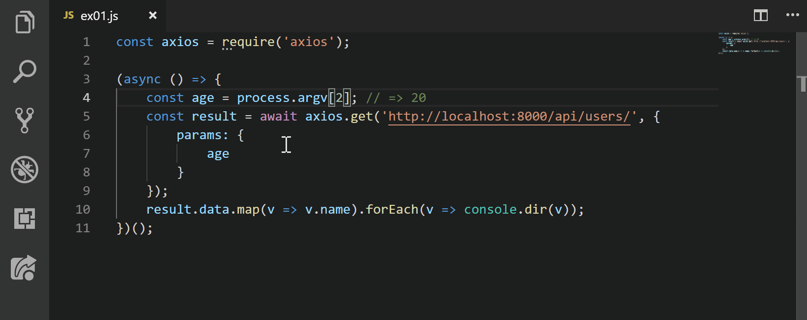

# Search with Qiita



これは非公式なQiita検索の拡張機能です.
- 検索したい文字列を選択後`ctrl+shift+P`で`qiita search`を検索するか、右上のQiitaボタンを利用してください.
- (ver 0.2.0)未選択状態での検索機能を実装しました.
- ファイル名から使用言語を特定してタグ付けしています.
- ファイルのタグが割り与えられていない場合はconfigで設定してください.
    - 設定例
    ```json
    "search-with-qiita.customDocs": {
        "md": "markdown",
        ・・・
        ・・・
    }
    ```
- 現在以下の拡張子はすでに割り振ってあります
```json
{
  "py": "python",
  "js": "javascript",
  "ts": "typescript",
  "kt": "kotlin",
  "rb": "ruby",
  "htm": "html",
  "cpp": "c++",
  "md": "markdown"
}
```


This is a extension allowing developers to search with Qiita of any highlighted text, straight from the VS Code editor.


* Highlight some text in the editor (or just point the cursor inside a word)
* Use the VS Code Command Palette or Menu tool button to launch a preview window with the Google search results
* Links from the search open in your default browser
* Code and search without needing to switch between your browser and IDE

### 参考
https://github.com/adelphes/google-search-ext

https://github.com/cxfksword/vscode-goto-documentation

https://github.com/burcadoruciprian/vscode-simple-search